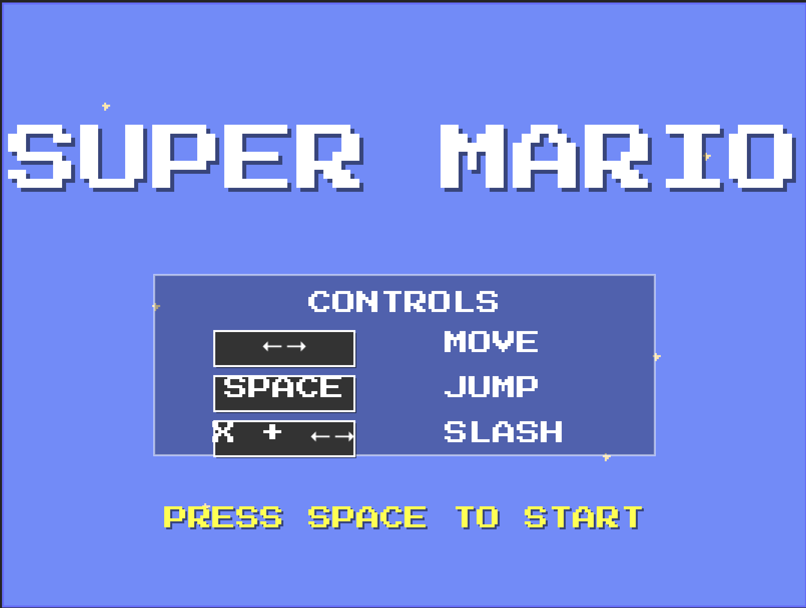
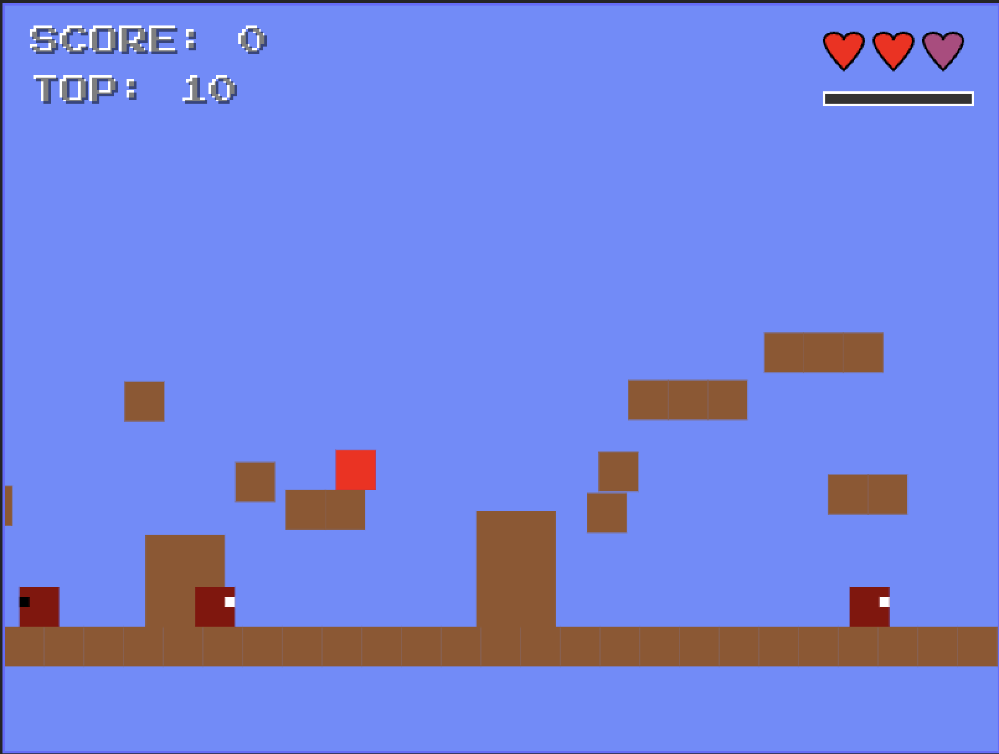

# Super Brick Mario

<div align="center">
  
  
</div>

A web-based game inspired by classic platformers, built with TypeScript and Vite.

## Prerequisites

- Node.js (v20.17.0 or higher)
- pnpm (preferred) or npm

## Getting Started

1. Clone the repository:
```bash
git clone https://github.com/bearmug/super-brick-mario.git
cd super-brick-mario
```

2. Install dependencies:
```bash
pnpm install
```

3. Start development server:
```bash
pnpm dev
```

The game will be available at `http://localhost:5173`

## Build for Production

To create a production build:
```bash
pnpm build
```

To preview the production build locally:
```bash
pnpm preview
```

## Tech Stack

- TypeScript
- Vite
- HTML5 Canvas

## License

MIT 